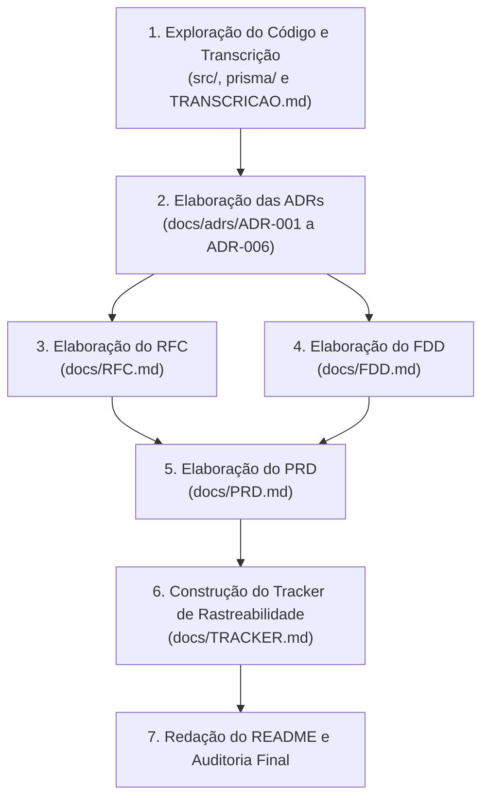

# Da Reunião ao Documento: Design Docs Gerados por IA
> **MBA em Inteligência Artificial — Full Cycle**  
> **Aluno:** Anderson Vilela  
> **Entrega:** Pacote Completo de Design Docs (PRD, RFC, FDD, ADRs, Tracker e Relato de Processo)

---

## 1. Sobre o Desafio

Este projeto tem como objetivo simular a atuação de um Arquiteto de Software e Tech Lead no papel de "maestro de Inteligência Artificial". O desafio consistiu em recepcionar a gravação transcrita de uma reunião técnica real ([`TRANSCRICAO.md`](TRANSCRICAO.md)) de aproximadamente 55 minutos entre Tech Lead, Product Manager, Engenheiros de Software e Segurança, e transformá-la em um pacote robusto e profissional de documentação de engenharia de software para uma nova funcionalidade: o **Sistema de Webhooks de Notificação de Pedidos**.

A aplicação existente é um **Order Management System (OMS)** em produção desenvolvido em Node.js com TypeScript, Express, Prisma ORM e banco de dados MySQL, o qual apresentava uma lacuna proposital: a ausência total de infraestrutura de eventos, filas ou webhooks. A missão documental foi projetar essa extensão técnica sem alterar nenhuma linha de código pré-existente (`src/`, `prisma/`, `tests/`), garantindo que 100% dos requisitos, decisões e restrições fossem estritamente rastreáveis à transcrição ou aos arquivos reais da aplicação, combatendo qualquer alucinação de IA.

---

## 2. Ferramentas de IA Utilizadas

Para conduzir a engenharia reversa do código, análise de transcrição e confecção documental em múltiplos níveis de abstração, utilizou-se o seguinte ecossistema:

* **Google Antigravity (com modelo Gemini):** Ferramenta primária de orquestração agentic coding. Utilizada para inspecionar estruturadamente os arquivos de código TypeScript e schemas Prisma, analisar a integridade de [`TRANSCRICAO.md`](TRANSCRICAO.md), redigir os documentos em Markdown e validar os critérios de aceite.
* **Claude / ChatGPT (LLMs de Apoio e Refinamento):** Modelos auxiliares acionados para validação semântica cruzada, refinamento de clareza textual nas seções de trade-offs arquiteturais e auditoria das tabelas de rastreabilidade.

---

## 3. Workflow Adotado

O fluxo de trabalho foi estruturado de forma hierárquica e incremental, evitando a produção de documentos genéricos ou sobrepostos. Adotou-se o princípio da **diferenciação de altura documental**:



1. **Fase 1 — Exploração e Mapeamento Cruzado:** Leitura minuciosa da transcrição identificando os atores, os clientes B2B demandantes (Atlas Comercial, MaxDistribuição, Nova Cargo), decisões tomadas, itens descartados e pontos adiados. Paralelamente, auditoria dos arquivos do repositório (`order.service.ts`, `schema.prisma`, `auth.middleware.ts`, etc.).
2. **Fase 2 — ADRs Primeiro:** Registro das 6 decisões arquiteturais no formato MADR. Como as decisões pontuais fundamentam a arquitetura, escrevê-las primeiro evitou contradições futuras.
3. **Fase 3 — RFC (Arquitetura e Trade-offs):** Redação da proposta em nível arquitetural (2 a 4 páginas), focando nos "porquês", nas alternativas descartadas (ex: Redis Streams vs MySQL Outbox) e nas questões em aberto, apontando links para as ADRs.
4. **Fase 4 — FDD (Especificação Técnica de Implementação):** Construção do documento cirúrgico para os desenvolvedores: contratos de API, JSON payloads, matriz de erros no padrão `WEBHOOK_*`, diagramas de sequência e a seção de integração com 6 arquivos reais do projeto.
5. **Fase 5 — PRD (Visão de Produto e Negócio):** Consolidação dos requisitos de negócio, metas quantitativas (latência $< 10\text{s}$, redução de polling $\ge 75\%$), 12 requisitos funcionais e tabela de riscos.
6. **Fase 6 — Tracker de Rastreabilidade:** Mapeamento minucioso de 50 itens conectando PRD, RFC, FDD e ADRs às suas origens na transcrição (formato `[hh:mm] Nome`) e no código fonte.
7. **Fase 7 — Relato do Processo e Auditoria:** Substituição do README e verificação estrita de cada critério de aceite da checklist.

---

## 4. Prompts Customizados

Abaixo destacam-se dois dos prompts estruturados fundamentais desenvolvidos e utilizados durante as iterações com a IA:

### Prompt 1: Extração e Formalização de ADRs (Formato MADR)

```markdown
Você é um Arquiteto de Software Especialista atuando como Tech Lead.
Analise detalhadamente o arquivo TRANSCRICAO.md e a estrutura do código base em src/ e prisma/.
Sua tarefa é formalizar as decisões arquiteturais tomadas pela equipe no formato MADR (Markdown Architectural Decision Records).

Diretrizes obrigatórias:
1. Para cada decisão, gere um arquivo docs/adrs/ADR-NNN-titulo-kebab-case.md.
2. Cada ADR deve conter rigorosamente as seções: Status, Contexto, Decisão, Alternativas Consideradas (com trade-off explícito de descarte) e Consequências (positivas e negativas/trade-offs).
3. Não alucine tecnologias ausentes na reunião: a equipe decidiu expressamente por MySQL Outbox, Worker separado em polling de 2s, retry de 5 etapas com DLQ, HMAC-SHA256 com secret por endpoint, at-least-once com X-Event-Id e reuso de padrões existentes.
4. Pelo menos uma ADR deve citar explicitamente os módulos, arquivos e classes reais da codebase existente (como OrderService, Prisma, AppError e Pino).
5. Extraia argumentos técnicos reais citados pelos participantes (Larissa, Marcos, Bruno, Diego, Sofia).
```

### Prompt 2: Elaboração dos Contratos e Integração no FDD

```markdown
Atue como Engenheiro de Software Sênior encarregado de escrever o Feature Design Document (docs/FDD.md).
O documento precisa ser acionável e detalhado o suficiente para um desenvolvedor pleno iniciar a codificação imediatamente.

Requisitos mandatórios para o documento:
1. Apresente os fluxos de criação da outbox, ciclo do worker, retries e DLQ com diagramas de sequência/flowchart Mermaid.
2. Na seção "Contratos públicos", documente pelo menos 4 endpoints HTTP com método, URL, headers, corpo de requisição, corpo de resposta de sucesso (2xx), corpo de erro e status codes HTTP. Adicione também o contrato do payload HTTP enviado ao servidor do parceiro B2B.
3. Elabore a Matriz de Erros utilizando obrigatoriamente códigos canônicos com o prefixo "WEBHOOK_*", derivados da classe AppError existente.
4. Seção obrigatória: "Integração com o sistema existente". Cite pelo menos 4 caminhos de arquivos reais do repositório (ex: src/modules/orders/order.service.ts, prisma/schema.prisma, src/shared/errors/index.ts, src/routes/index.ts, src/middlewares/auth.middleware.ts, src/server.ts) e descreva com precisão cirúrgica como a nova feature se acopla a cada um, especialmente como o método changeStatus executará o publishWebhookEvent na mesma transação SQL.
```

---

## 5. Iterações e Ajustes

Durante a produção documental com os modelos de IA, o papel de "maestro" foi essencial para identificar e corrigir desvios técnicos, superficialidades e potenciais alucinações. Destacam-se três momentos marcantes de intervenção crítica:

* **Ajuste 1 — Eliminação de Sugestões de Mensageria Externa (Redis/Kafka):**  
  * *Problema:* Nas primeiras gerações de rascunho de arquitetura, a IA insistiu em sugerir Redis Streams ou RabbitMQ como fila assíncrona recomendada, por ser o padrão mais comum em artigos técnicos da internet.
  * *Correção:* Intervim prontamente restringindo o contexto ao que foi deliberado na reunião. Na transcrição ([09:06]–[09:07]), Diego e Larissa descartaram expressamente qualquer infraestrutura extra por considerarem *overengineering* para uma equipe pequena, optando pelo padrão Transactional Outbox diretamente no banco relacional MySQL existente. Ajustei o prompt para exigir a modelagem da tabela `webhook_outbox` no MySQL via Prisma e documentar Redis estritamente como alternativa descartada no RFC e na ADR-001.
* **Ajuste 2 — Contenção de Escopo e Limite de Payload (< 64KB):**  
  * *Problema:* Ao modelar o payload do evento de notificação no FDD e PRD, a IA gerou um payload volumoso contendo a lista completa de produtos, itens do pedido (`items: [...]`), endereços completos e dados fiscais.
  * *Correção:* Corrigi a modelagem relembrando a decisão explícita registrada em [09:43] Diego e Bruno, na qual foi acordado que o payload seria enxuto (apenas metadados do pedido: `orderId`, `orderNumber`, `fromStatus`, `toStatus`, `totalCents`) e com teto rígido de 64KB ([09:24] Diego). Se o cliente desejar itens detalhados, deve consultar a rota existente `GET /orders/:id`. O payload foi reescrito e adicionou-se a validação de erro `WEBHOOK_PAYLOAD_TOO_LARGE`.
* **Ajuste 3 — Acoplamento do `OrderService` e Atomicidade Transacional:**  
  * *Problema:* A IA propôs inicialmente injetar um repositório completo de webhooks dentro da classe `OrderService`, além de sugerir chamadas assíncronas soltas após o retorno da transação do banco de dados.
  * *Correção:* Ajustei a especificação técnica no FDD e na ADR-006 para seguir a solução desenhada por Bruno em [09:40]–[09:41]: o método `changeStatus` já opera em `prisma.$transaction`. Para manter baixo acoplamento e atomicidade absoluta (evitando o problema de dual-write), foi definida uma função pura `publishWebhookEvent(tx, order, from, to)` que recebe exclusivamente o cliente da transação ativa (`tx`). Se o insert na outbox falhar, a transação inteira sofre rollback.

---

## 6. Como Navegar a Entrega

Todos os documentos foram entregues em formato Markdown padronizado dentro do repositório. Para uma compreensão clara e coerente da solução técnica proposta, recomenda-se a seguinte ordem de leitura:

```
mba-ia-desafio-design-docs-com-ia/
├── README.md                                  # 1. Visão geral, jornada e workflow (este documento)
├── TRANSCRICAO.md                             # 2. Fonte primária: transcrição da reunião técnica
└── docs/
    ├── PRD.md                                 # 3. Visão de Produto, Negócio e Requisitos (Por que e o quê?)
    ├── RFC.md                                 # 4. Proposta Técnica de Arquitetura e Trade-offs (Como propomos?)
    ├── adrs/                                  # 5. Decisões Arquiteturais Isoladas em formato MADR
    │   ├── ADR-001-padrao-outbox-no-mysql.md
    │   ├── ADR-002-worker-em-processo-separado-com-polling.md
    │   ├── ADR-003-politica-de-retry-com-backoff-exponencial-e-dlq.md
    │   ├── ADR-004-autenticacao-hmac-sha256-com-secret-por-endpoint.md
    │   ├── ADR-005-garantia-de-entrega-at-least-once-com-x-event-id.md
    │   └── ADR-006-reuso-dos-padroes-arquiteturais-existentes.md
    ├── FDD.md                                 # 6. Desenho de Implementação, Contratos e Código (Como construir?)
    └── TRACKER.md                             # 7. Matriz de Rastreabilidade Cruzada Antialucinação (De onde veio?)
```

### Guia Rápido de Arquivos:

1. [`docs/PRD.md`](docs/PRD.md): Contexto de negócio, metas de SLA ($p99 < 10\text{s}$), retenção da Atlas Comercial, 12 requisitos funcionais, exclusões de escopo e riscos com mitigação.
2. [`docs/RFC.md`](docs/RFC.md): Proposta técnica concisa para alinhamento do time, revisores da call, descarte fundamentado de alternativas (Redis, chamadas síncronas e triggers) e questões em aberto.
3. [`docs/adrs/`](docs/adrs/): Conjunto de 6 ADRs cobrindo as 6 decisões fundamentais tomadas na reunião técnica.
4. [`docs/FDD.md`](docs/FDD.md): Documento cirúrgico contendo diagramas de sequência, contratos de 5 endpoints + envio ao parceiro, matriz de erros com prefixo `WEBHOOK_*`, estratégias de observabilidade e integração com 6 arquivos reais do código.
5. [`docs/TRACKER.md`](docs/TRACKER.md): Tabela de auditoria mapeando 50 itens a timestamps da reunião (`[hh:mm] Nome`) e caminhos de arquivos da aplicação (`src/...`).
