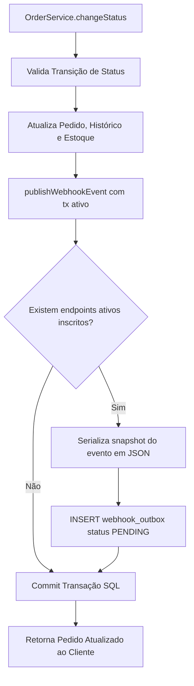
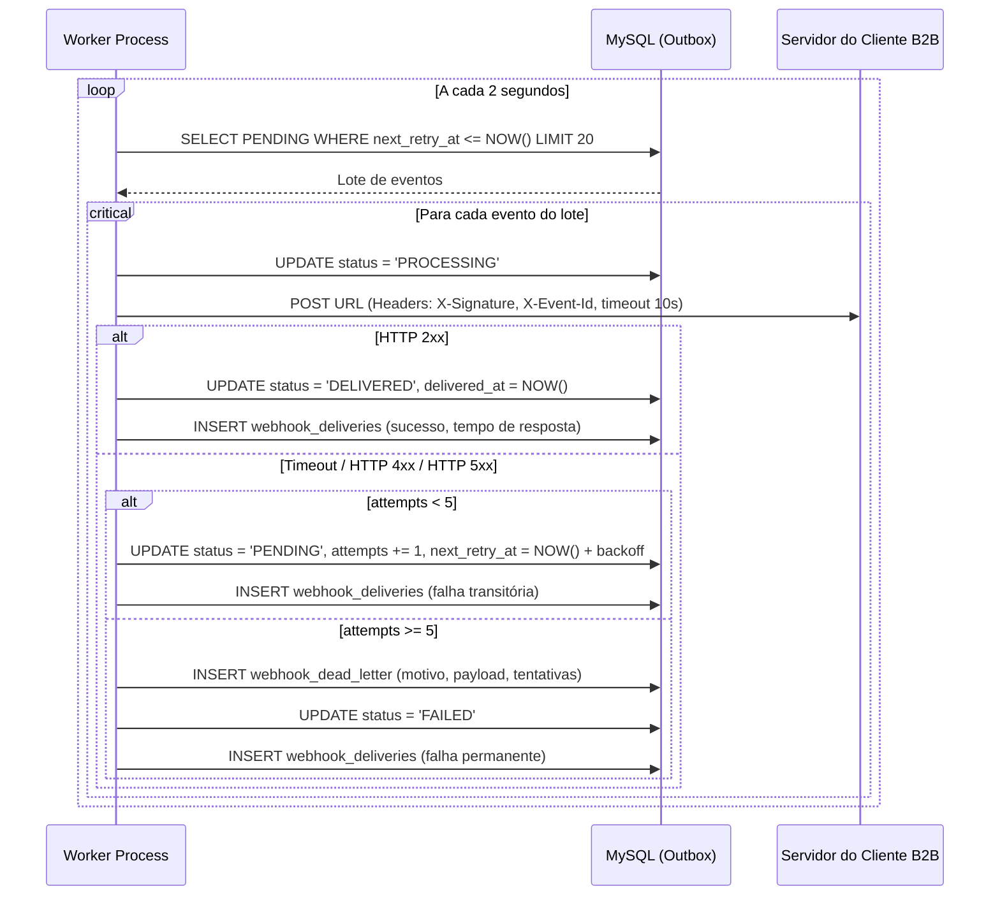

# FDD — Feature Design Document: Sistema de Webhooks de Notificação de Pedidos

## 1. Contexto e Motivação Técnica
A plataforma Order Management System (OMS) processa pedidos de múltiplos parceiros comerciais com controle transacional rigoroso de estoque e auditoria de estados. Três grandes clientes corporativos B2B (**Atlas Comercial**, **MaxDistribuição** e **Nova Cargo**) necessitam de notificações instantâneas sobre mudanças no ciclo de vida dos pedidos (`PAID`, `PROCESSING`, `SHIPPED`, `DELIVERED`, `CANCELLED`).

Atualmente, esses parceiros executam consultas frequentes no endpoint `GET /orders`, sobrecarregando a API e o banco relacional MySQL. Para sanar esse problema e evitar a evasão de clientes, este documento especifica tecnicamente a implementação de um sistema assíncrono de **Webhooks de Saída (*Outbound Webhooks*)**, desacoplado da transação da API e baseado no padrão **Transactional Outbox**.

---

## 2. Objetivos Técnicos
* **Latência de Notificação:** Despachar notificações com tempo de entrega inferior a 10 segundos ($p99 < 10\text{s}$) após a confirmação transacional da mudança de status do pedido.
* **Consistência Transacional:** Eliminar o risco de disparos fantasmas ou perda de eventos através de escrita atômica no MySQL via Prisma `$transaction`.
* **Garantia de Entrega:** Assegurar entrega no modelo *at-least-once*, fornecendo cabeçalho `X-Event-Id` para desduplicação e idempotência pelo consumidor.
* **Segurança e Integridade:** Assinar digitalmente todo payload HTTP com `HMAC-SHA256` utilizando chave secreta exclusiva por endpoint, com suporte a rotação com *grace period* de 24 horas e imposição de HTTPS.
* **Resiliência e Recuperação:** Tolerar instabilidades externas através de 5 tentativas com *backoff* exponencial e transbordo para Dead Letter Queue (DLQ) com replay administrativo.

---

## 3. Escopo e Exclusões

### No Escopo
* Modelagem das tabelas `webhook_endpoints`, `webhook_outbox`, `webhook_deliveries` e `webhook_dead_letter` no Prisma.
* Gancho transacional no método `changeStatus` de [`src/modules/orders/order.service.ts`](file:///home/anderson/projects/fullcycle/mba-ia-desafio-design-docs-com-ia/src/modules/orders/order.service.ts) via `publishWebhookEvent`.
* Processo worker independente em [`src/worker.ts`](file:///home/anderson/projects/fullcycle/mba-ia-desafio-design-docs-com-ia/src/worker.ts) operando em *polling* de 2 segundos.
* Mecanismo de assinatura criptográfica `HMAC-SHA256` e cabeçalhos de rastreabilidade.
* Ciclo de retry em 5 intervalos ($1\text{m}, 5\text{m}, 30\text{m}, 2\text{h}, 12\text{h}$) e persistência em DLQ.
* Endpoints REST para gerenciamento de endpoints de webhook e consulta de entregas.
* Endpoint restrito à role `ADMIN` para replay de mensagens da DLQ.

### Fora de Escopo (Exclusões)
* Ingestão de webhooks de terceiros (*inbound webhooks*).
* Notificações de alerta via e-mail para endpoints com falhas repetidas.
* Interface gráfica (UI/Dashboard web) para configuração de webhooks por usuários finais.
* Política automatizada de expurgo/arquivamento da tabela outbox após 30 dias (prevista para fase posterior).
* *Rate limiting* / *throttling* adaptativo por domínio de cliente receptor.

---

## 4. Fluxos Detalhados

### 4.1. Enfileiramento na Outbox (Produtor)
O enfileiramento ocorre durante a transição de status do pedido:
1. O cliente ou operador invoca `PATCH /orders/:id/status`.
2. O método `changeStatus` abre uma transação interativa Prisma (`prisma.$transaction`).
3. As operações de validação de transição, débito/estorno de estoque e criação de histórico são executadas.
4. A função `publishWebhookEvent(tx, order, fromStatus, toStatus)` é invocada recebendo o cliente da transação `tx`:
   * Consulta se existem registros em `webhook_endpoints` ativos para o `customerId` do pedido que estejam inscritos no evento `toStatus`.
   * Se não houver endpoints inscritos, a função retorna sem gerar registros, poupando I/O.
   * Se houver endpoints inscritos, gera um snapshot do payload do evento em JSON (`OrderWebhookPayload`) e insere um registro na tabela `webhook_outbox` para cada endpoint com status `PENDING`, `attempts = 0` e `nextRetryAt = NOW()`.
5. A transação SQL é commitada atomicamente.



### 4.2. Processamento e Despacho pelo Worker (Consumidor)
O entry-point [`src/worker.ts`](file:///home/anderson/projects/fullcycle/mba-ia-desafio-design-docs-com-ia/src/worker.ts) orquestra a leitura periódica:
1. A cada 2 segundos, o worker executa uma consulta:
   ```sql
   SELECT * FROM webhook_outbox 
   WHERE status = 'PENDING' AND next_retry_at <= NOW()
   ORDER BY created_at ASC 
   LIMIT 20;
   ```
2. Para cada evento retornado:
   * Atualiza o status para `PROCESSING` com lock de controle.
   * Recupera a secret ativa do endpoint correspondente.
   * Gera o cabeçalho `X-Signature` calculando `HMAC-SHA256(rawPayload, secret)`.
   * Monta os cabeçalhos: `X-Event-Id`, `X-Timestamp`, `X-Webhook-Id`, `Content-Type: application/json`.
   * Dispara requisição HTTP `POST` para a URL do endpoint com timeout estrito de 10 segundos.



### 4.3. Política de Retry e Backoff Exponencial
Caso a requisição falhe por timeout, erro de rede ou código HTTP diferente da faixa $2xx$:
* A contagem de tentativas (`attempts`) é incrementada.
* O próximo disparo (`next_retry_at`) é calculado com base na tabela:
  * **Tentativa 1:** $+1$ minuto
  * **Tentativa 2:** $+5$ minutos
  * **Tentativa 3:** $+30$ minutos
  * **Tentativa 4:** $+2$ horas
  * **Tentativa 5:** $+12$ horas
* O status do evento retorna para `PENDING`.

### 4.4. Transbordo para DLQ e Replay
Ao falhar na 5ª tentativa consecutiva:
1. O evento é marcado como `FAILED` na tabela `webhook_outbox`.
2. Uma entrada é criada em `webhook_dead_letter` contendo o payload, última resposta HTTP e causa do erro.
3. Um operador autenticado com role `ADMIN` pode acionar `POST /admin/webhooks/dead-letter/:id/replay`. O registro é validado, inserido novamente na `webhook_outbox` como `PENDING` com `attempts = 0` e a ação é auditada via logs estruturados Pino.

---

## 5. Contratos Públicos

### 5.1. `POST /webhooks/endpoints`
Cadastra um novo endpoint receptor para receber notificações de pedidos de um cliente.

* **Autenticação:** Requer JWT de usuário autenticado (`OPERATOR` ou `ADMIN`).
* **Headers:**
  ```http
  Content-Type: application/json
  Authorization: Bearer <jwt-token>
  ```
* **Request Body:**
  ```json
  {
    "customerId": "d3b07384-d113-496e-a342-6e2c39e261f9",
    "url": "https://api.atlascomercial.com.br/webhooks/orders",
    "description": "Servidor de ingestão logística principal",
    "events": ["PAID", "PROCESSING", "SHIPPED", "DELIVERED", "CANCELLED"]
  }
  ```
* **Response `201 Created`:**
  ```json
  {
    "success": true,
    "data": {
      "id": "e4c85206-8fb1-4328-86d2-3bfdf6815340",
      "customerId": "d3b07384-d113-496e-a342-6e2c39e261f9",
      "url": "https://api.atlascomercial.com.br/webhooks/orders",
      "description": "Servidor de ingestão logística principal",
      "secret": "whsec_8f9c1b7a63e2d5c4b1a8f9e0d2c3b4a5",
      "events": ["PAID", "PROCESSING", "SHIPPED", "DELIVERED", "CANCELLED"],
      "active": true,
      "createdAt": "2026-09-05T12:00:00.000Z",
      "updatedAt": "2026-09-05T12:00:00.000Z"
    }
  }
  ```
* **Response `400 Bad Request` (ex: URL não HTTPS):**
  ```json
  {
    "success": false,
    "error": {
      "code": "WEBHOOK_INVALID_URL",
      "message": "Endpoint URL must strictly use HTTPS protocol",
      "details": [{ "path": "url", "message": "Invalid protocol. Only https:// is allowed" }]
    }
  }
  ```

---

### 5.2. `GET /webhooks/endpoints`
Lista os endpoints de webhooks cadastrados para um determinado cliente.

* **Autenticação:** Requer JWT (`OPERATOR` ou `ADMIN`).
* **Query Parameters:** `customerId=d3b07384-d113-496e-a342-6e2c39e261f9`
* **Response `200 OK`:**
  ```json
  {
    "success": true,
    "data": [
      {
        "id": "e4c85206-8fb1-4328-86d2-3bfdf6815340",
        "customerId": "d3b07384-d113-496e-a342-6e2c39e261f9",
        "url": "https://api.atlascomercial.com.br/webhooks/orders",
        "description": "Servidor de ingestão logística principal",
        "events": ["PAID", "SHIPPED", "DELIVERED"],
        "active": true,
        "createdAt": "2026-09-05T12:00:00.000Z"
      }
    ]
  }
  ```

---

### 5.3. `POST /webhooks/endpoints/:id/rotate-secret`
Gera uma nova chave secreta para o endpoint, mantendo a chave anterior válida por um período de tolerância (*grace period*) de 24 horas.

* **Autenticação:** Requer JWT (`OPERATOR` ou `ADMIN`).
* **Path Parameters:** `id` (UUID do endpoint).
* **Response `200 OK`:**
  ```json
  {
    "success": true,
    "data": {
      "endpointId": "e4c85206-8fb1-4328-86d2-3bfdf6815340",
      "newSecret": "whsec_99a8b7c6d5e4f3a2b1c0d9e8f7a6b5c4",
      "previousSecretExpiresAt": "2026-09-06T12:00:00.000Z",
      "message": "Secret rotated successfully. Previous secret remains valid for 24 hours."
    }
  }
  ```

---

### 5.4. `GET /webhooks/endpoints/:id/deliveries`
Consulta o histórico de disparos e entregas realizadas para um endpoint de webhook.

* **Autenticação:** Requer JWT (`OPERATOR` ou `ADMIN`).
* **Query Parameters:** `limit=50&offset=0`
* **Response `200 OK`:**
  ```json
  {
    "success": true,
    "data": {
      "deliveries": [
        {
          "id": "7b8a1c90-983b-4876-b68e-ff6a382b6a22",
          "eventId": "a1b2c3d4-e5f6-7a8b-9c0d-1e2f3a4b5c6d",
          "orderId": "3fa85f64-5717-4562-b3fc-2c963f66afa6",
          "status": "DELIVERED",
          "statusCode": 200,
          "durationMs": 342,
          "attempt": 1,
          "requestTimestamp": "2026-09-05T12:05:02.000Z",
          "responseBody": "{\"received\": true}"
        },
        {
          "id": "6c7d2e81-872a-3765-a57d-ee5b271a5b11",
          "eventId": "b2c3d4e5-f6a7-8b9c-0d1e-2f3a4b5c6d7e",
          "orderId": "1bb95f64-1212-4562-a3fc-2c963f66afa1",
          "status": "FAILED",
          "statusCode": 504,
          "durationMs": 10005,
          "attempt": 1,
          "requestTimestamp": "2026-09-05T12:10:00.000Z",
          "errorMessage": "Gateway Timeout (HTTP 504)"
        }
      ],
      "total": 2,
      "limit": 50,
      "offset": 0
    }
  }
  ```

---

### 5.5. `POST /admin/webhooks/dead-letter/:id/replay`
Endpoint restrito a administradores para reprocessar um evento em Dead Letter Queue.

* **Autenticação:** Requer JWT com role `ADMIN` (validado por `requireRole('ADMIN')`).
* **Path Parameters:** `id` (UUID do registro na tabela `webhook_dead_letter`).
* **Response `200 OK`:**
  ```json
  {
    "success": true,
    "data": {
      "replayed": true,
      "deadLetterId": "9f8e7d6c-5b4a-3f2e-1d0c-b9a8f7e6d5c4",
      "outboxEventId": "a1b2c3d4-e5f6-7a8b-9c0d-1e2f3a4b5c6d",
      "status": "PENDING",
      "replayedByUserId": "c92d56a2-9599-4d64-83ef-d6216ec8dfd2",
      "replayedAt": "2026-09-05T14:30:00.000Z"
    }
  }
  ```

---

### 5.6. Contrato de Envio (Outbound HTTP Request do Worker para o Parceiro)
Requisição HTTP enviada pelo worker do OMS para a URL do cliente B2B:

* **Método:** `POST`
* **URL:** `<url-cadastrada-pelo-cliente>`
* **Cabeçalhos Enviados:**
  ```http
  Content-Type: application/json
  User-Agent: OMS-Webhook-Worker/1.0
  X-Event-Id: a1b2c3d4-e5f6-7a8b-9c0d-1e2f3a4b5c6d
  X-Webhook-Id: e4c85206-8fb1-4328-86d2-3bfdf6815340
  X-Timestamp: 1788613502
  X-Signature: 6e08c4e4d7d3d7dfd1b82e2ecfbe0ef50d75c9cfbc7bdf559bf7aef4e1e12ef5
  ```
* **Payload JSON:**
  ```json
  {
    "eventId": "a1b2c3d4-e5f6-7a8b-9c0d-1e2f3a4b5c6d",
    "eventType": "order.status_changed",
    "timestamp": "2026-09-05T12:05:02.000Z",
    "order": {
      "id": "3fa85f64-5717-4562-b3fc-2c963f66afa6",
      "orderNumber": "ORD-2026-0042",
      "customerId": "d3b07384-d113-496e-a342-6e2c39e261f9",
      "fromStatus": "PAID",
      "toStatus": "PROCESSING",
      "totalCents": 12990,
      "updatedAt": "2026-09-05T12:05:01.890Z"
    }
  }
  ```
* **Expectativa de Retorno:** O parceiro deve processar a requisição e responder com qualquer status na faixa `2xx` (ex: `200 OK` ou `204 No Content`) em até 10 segundos.

---

## 6. Matriz de Erros Previstos (Padrão `WEBHOOK_*`)

Todos os erros lançados pelo subsistema herdam de [`AppError`](file:///home/anderson/projects/fullcycle/mba-ia-desafio-design-docs-com-ia/src/shared/errors/app-error.ts) e utilizam códigos estritos com o prefixo `WEBHOOK_`:

| Código de Erro | Status HTTP | Mensagem Descritiva | Cenário de Ocorrência |
| :--- | :---: | :--- | :--- |
| `WEBHOOK_NOT_FOUND` | 404 | *Webhook endpoint not found* | Tentativa de consulta, rotação ou remoção de um endpoint com ID inexistente. |
| `WEBHOOK_INVALID_URL` | 400 | *Invalid webhook URL format or destination* | URL com formato inválido, malformada ou apontando para host privado/inválido. |
| `WEBHOOK_HTTPS_REQUIRED` | 400 | *Webhook URL must use secure HTTPS protocol* | Tentativa de cadastro ou atualização com esquema `http://`. |
| `WEBHOOK_CUSTOMER_NOT_FOUND` | 404 | *Customer associated with webhook was not found* | Cadastro de webhook referenciando um `customerId` inexistente no banco. |
| `WEBHOOK_EVENT_FILTER_INVALID` | 400 | *Invalid status event in webhook filter list* | Solicitação de inscrição em evento desconhecido (fora do enum `OrderStatus`). |
| `WEBHOOK_PAYLOAD_TOO_LARGE` | 422 | *Serialized webhook payload exceeds 64KB limit* | O snapshot do evento em JSON excede o teto estrito de 64KB. |
| `WEBHOOK_SECRET_REQUIRED` | 400 | *Secret key cannot be empty or missing* | Operação interna de validação de assinatura sem secret configurada. |
| `WEBHOOK_DELIVERY_TIMEOUT` | 504 | *Client webhook endpoint timed out after 10 seconds* | Servidor do cliente B2B não respondeu dentro do limite estrito de 10s. |
| `WEBHOOK_DELIVERY_FAILED` | 502 | *Client endpoint returned non-2xx status code* | Servidor do cliente respondeu com código de erro HTTP (ex: 400, 500, 503). |
| `WEBHOOK_MAX_RETRIES_EXCEEDED` | 500 | *Maximum retry attempts reached; moved to DLQ* | Esgotamento das 5 tentativas de retentativa; evento transbordado para DLQ. |
| `WEBHOOK_DEAD_LETTER_NOT_FOUND` | 404 | *Dead letter record not found for replay* | Tentativa de executar replay em ID de DLQ inexistente ou já reprocessado. |

---

## 7. Estratégias de Resiliência

1. **Timeouts Rígidos de Chamada:** Cada requisição de saída (*outbound*) executada pelo worker é configurada com timeout de 10.000 ms (10s) via `AbortController`.
2. **Backoff Exponencial Desacoplado:** O cálculo de retentativa ocorre no banco através do campo `next_retry_at`. Falhas temporárias não bloqueiam a fila de eventos de outros clientes, pois o worker processa apenas eventos elegíveis (`next_retry_at <= NOW()`).
3. **Isolamento de Falha por DLQ:** Ao atingir a 5ª tentativa sem sucesso, o evento sai do fluxo ativo da outbox e é arquivado na tabela `webhook_dead_letter`. Isso evita que clientes permanentemente inoperantes provoquem consumo contínuo de I/O e CPU no worker.
4. **Idempotência no Consumo:** A garantia *at-least-once* mitiga a perda de dados em falhas de rede. O cabeçalho `X-Event-Id` fornece a âncora necessária para que os clientes implementem desduplicação sem esforço.

---

## 8. Observabilidade

A infraestrutura de observabilidade reutilizará o ecossistema existente da aplicação e abrangerá:

### 8.1. Métricas
* `webhooks_dispatch_total{status="success|failure", customer_id="..."}`: Contador de tentativas de despacho de webhooks.
* `webhooks_dispatch_duration_ms`: Histograma da latência das chamadas HTTP externas (percentis p50, p95 e p99).
* `webhooks_outbox_pending_gauge`: Indicador em tempo real da quantidade de eventos pendentes na tabela outbox.
* `webhooks_dead_letter_total`: Contador acumulado de eventos encaminhados para a DLQ.

### 8.2. Logs Estruturados (Pino)
Reutilizando o logger nativo em [`src/shared/logger/index.ts`](file:///home/anderson/projects/fullcycle/mba-ia-desafio-design-docs-com-ia/src/shared/logger/index.ts), cada ciclo de processamento emitirá registros JSON contendo metadados essenciais:
```json
{
  "level": "info",
  "time": 1788613502345,
  "msg": "webhook_dispatch_success",
  "eventId": "a1b2c3d4-e5f6-7a8b-9c0d-1e2f3a4b5c6d",
  "webhookId": "e4c85206-8fb1-4328-86d2-3bfdf6815340",
  "customerId": "d3b07384-d113-496e-a342-6e2c39e261f9",
  "url": "https://api.atlascomercial.com.br/webhooks/orders",
  "statusCode": 200,
  "durationMs": 342,
  "attempt": 1
}
```

### 8.3. Distributed Tracing
* Propagação de cabeçalhos padrão W3C Trace Context (`traceparent`) nas chamadas HTTP de saída do worker, permitindo correlacionar logs de ponta a ponta desde a alteração do pedido na API até a recepção pelo cliente corporativo.

---

## 9. Dependências e Compatibilidade
* **Linguagem & Runtime:** Node.js (v20+) com TypeScript em modo ESM (`NodeNext`).
* **Framework Web:** Express 4.x.
* **ORM & Banco:** Prisma ORM com MySQL 8.0.
* **Validação de Schemas:** Zod.
* **Criptografia:** Módulo nativo `node:crypto` (`createHmac`, `randomBytes`).
* **Logging:** Pino e pino-http.
* **Compatibilidade:** Total retrocompatibilidade com as APIs públicas do OMS; nenhuma rota existente sofrerá quebras contratuais.

---

## 10. Integração com o Sistema Existente

A implementação da feature se integra a **6 arquivos reais e estratégicos** do código base:

### 1. [`src/modules/orders/order.service.ts`](file:///home/anderson/projects/fullcycle/mba-ia-desafio-design-docs-com-ia/src/modules/orders/order.service.ts)
* **Ponto de Extensão:** Dentro do método `changeStatus`, que encapsula a transação atômica via `this.prisma.$transaction(async (tx) => { ... })`.
* **Mecanismo de Integração:** Após o `tx.order.update` e o `tx.orderStatusHistory.create`, será invocada a função pura `publishWebhookEvent(tx, refreshedOrder, from, to)`. Essa função insere os registros na tabela `webhook_outbox` utilizando a mesma transação SQL (`tx`). Se o insert da outbox falhar, a transação inteira do pedido sofre rollback automático, mantendo a consistência dos dados.

### 2. [`prisma/schema.prisma`](file:///home/anderson/projects/fullcycle/mba-ia-desafio-design-docs-com-ia/prisma/schema.prisma)
* **Ponto de Extensão:** Modelagem declarativa das novas entidades no schema do banco de dados.
* **Mecanismo de Integração:**
  * Adição do enum `WebhookStatus { PENDING, PROCESSING, DELIVERED, FAILED }`.
  * Criação do model `WebhookEndpoint` (relacionado com `Customer` via `customerId: db.Char(36)`), com colunas para URL, secret ativa, secret anterior e data de expiração da rotação.
  * Criação do model `WebhookOutbox` com colunas indexadas `status`, `nextRetryAt` e `createdAt`.
  * Criação dos models `WebhookDelivery` (auditoria de tentativas) e `WebhookDeadLetter` (DLQ).

### 3. [`src/shared/errors/index.ts`](file:///home/anderson/projects/fullcycle/mba-ia-desafio-design-docs-com-ia/src/shared/errors/index.ts) e [`src/shared/errors/app-error.ts`](file:///home/anderson/projects/fullcycle/mba-ia-desafio-design-docs-com-ia/src/shared/errors/app-error.ts)
* **Ponto de Extensão:** Hierarquia de erros da aplicação.
* **Mecanismo de Integração:** Criação de classes de erro de domínio específicas (`WebhookNotFoundError`, `WebhookValidationError`, `WebhookDeliveryError`) que herdam diretamente de `AppError`. Essas classes atribuem os códigos no padrão `WEBHOOK_*`, sendo automaticamente capturadas e formatadas pelo middleware [`src/middlewares/error.middleware.ts`](file:///home/anderson/projects/fullcycle/mba-ia-desafio-design-docs-com-ia/src/middlewares/error.middleware.ts) sem a necessidade de novos manipuladores.

### 4. [`src/routes/index.ts`](file:///home/anderson/projects/fullcycle/mba-ia-desafio-design-docs-com-ia/src/routes/index.ts) e [`src/app.ts`](file:///home/anderson/projects/fullcycle/mba-ia-desafio-design-docs-com-ia/src/app.ts)
* **Ponto de Extensão:** Mapeamento de rotas e injeção de dependências do Express.
* **Mecanismo de Integração:** A interface `Controllers` em `src/routes/index.ts` será estendida para receber `webhooks: WebhookController`. A rota `/webhooks` será montada via `router.use('/webhooks', buildWebhookRouter(controllers.webhooks))`. Em `src/app.ts`, as instâncias do repositório, serviço e controller de webhooks serão inicializadas durante o bootstrap.

### 5. [`src/middlewares/auth.middleware.ts`](file:///home/anderson/projects/fullcycle/mba-ia-desafio-design-docs-com-ia/src/middlewares/auth.middleware.ts)
* **Ponto de Extensão:** Camada de autenticação e autorização RBAC.
* **Mecanismo de Integração:** Reuso do middleware `authenticate` para proteger os endpoints do cliente e aplicação direta do `requireRole('ADMIN')` na rota de reprocessamento manual da DLQ (`POST /admin/webhooks/dead-letter/:id/replay`), assegurando governança estrita sobre a fila de eventos.

### 6. [`src/server.ts`](file:///home/anderson/projects/fullcycle/mba-ia-desafio-design-docs-com-ia/src/server.ts) e [`src/worker.ts`](file:///home/anderson/projects/fullcycle/mba-ia-desafio-design-docs-com-ia/src/worker.ts)
* **Ponto de Extensão:** Entry-points de execução da aplicação.
* **Mecanismo de Integração:** Enquanto `src/server.ts` permanece como processo exclusivo de atendimento HTTP, o novo arquivo `src/worker.ts` será criado espelhando as boas práticas de inicialização: instanciação isolada do `PrismaClient`, loop assíncrono controlado de polling e tratamento gracioso de encerramento (`SIGINT` e `SIGTERM`) para drenar requisições ativas antes do encerramento.

---

## 11. Critérios de Aceite Técnicos
* [ ] Mudança de status em `OrderService.changeStatus` e inserção na `webhook_outbox` são confirmadas atomicamente na mesma transação SQL.
* [ ] Worker executa polling contínuo a cada 2s em processo separado sem vazamento de conexões no Prisma.
* [ ] Validação rejeita qualquer endpoint com protocolo diferente de HTTPS retornando `400` com código `WEBHOOK_HTTPS_REQUIRED`.
* [ ] 100% das notificações emitidas contêm os cabeçalhos `X-Signature`, `X-Event-Id`, `X-Timestamp` e `X-Webhook-Id`.
* [ ] Assinatura `X-Signature` é calculada fielmente via HMAC-SHA256 e validável com a secret do endpoint.
* [ ] Rotas administrativas de DLQ rejeitam requisições de usuários sem a role `ADMIN` com status `403 Forbidden`.
* [ ] Latência entre a alteração do pedido e o primeiro despacho da notificação permanece abaixo de 10s no percentil 99 ($p99 < 10\text{s}$).

---

## 12. Riscos e Mitigação

| Risco Técnico | Severidade | Mitigação Arquitetural |
| :--- | :---: | :--- |
| **Esgotamento do Pool de Conexões do MySQL** | Alta | O worker roda como processo autônomo com sua própria instância de `PrismaClient`, dimensionando um pool pequeno (ex: 5 a 10 conexões) isolado do tráfego da API REST. |
| **Ataques de SSRF (Server-Side Request Forgery)** | Crítica | Validação rigorosa de URL no Zod proibindo endereços `localhost`, faixas de IP privadas (RFC 1918) e esquemas de rede não seguros. |
| **Lentidão em Massa por Clientes Travados** | Média | Timeout de rede rigoroso de 10 segundos em cada requisição de despacho, executado com `AbortSignal`. |
| **Acúmulo de Dados na Tabela Outbox** | Média | Criação de índices estratégicos em `(status, next_retry_at, created_at)` para garantir que consultas do worker operem em milissegundos mesmo com grande volume de dados históricos. |
