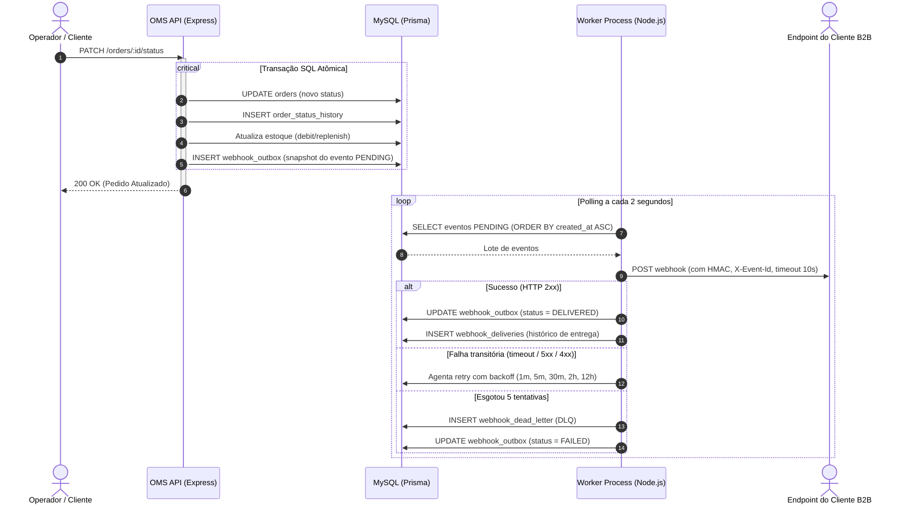

# RFC: Sistema de Webhooks de Notificação de Pedidos

## Metadados
* **Autor:** Anderson Vilela (Time de Engenharia de Software)
* **Status:** Em Revisão
* **Data:** 05 de Setembro de 2026
* **Revisores:**
  * Larissa (Tech Lead)
  * Marcos (Product Manager)
  * Bruno (Engenheiro de Software — Time de Pedidos)
  * Diego (Engenheiro Sênior — Time de Plataforma)
  * Sofia (Engenheira de Segurança)

---

## 1. Resumo Executivo (TL;DR)
Propõe-se a introdução de uma infraestrutura assíncrona de webhooks de saída (*outbound webhooks*) para notificar sistemas externos sobre mudanças no ciclo de vida dos pedidos do Order Management System (OMS).

A solução é fundamentada no **Transactional Outbox Pattern** suportado pelo banco relacional MySQL existente, dispensando filas ou middlewares de mensageria adicionais. Os eventos serão publicados na mesma transação atômica que altera o status do pedido e persistidos como snapshot na tabela `webhook_outbox`.

Um processo de worker desacoplado em Node.js (`src/worker.ts`), operando em *polling* contínuo de 2 segundos, despacha as notificações HTTP protegidas por assinatura criptográfica **HMAC-SHA256** com segredos rotacionáveis por endpoint. Resiliência a falhas de clientes é assegurada por **5 tentativas com backoff exponencial** (~15h de cobertura) e persistência de falhas terminais em **Dead Letter Queue (DLQ)** com suporte a reprocessamento manual administrativo. A entrega seguirá semântica **at-least-once**, com idempotência viabilizada pelo cabeçalho `X-Event-Id`.

---

## 2. Contexto e Problema
Atualmente, a plataforma atende múltiplos parceiros comerciais que realizam integração sistêmica através da API REST. Três grandes clientes corporativos B2B — **Atlas Comercial**, **MaxDistribuição** e **Nova Cargo** — necessitam acompanhar em tempo real as atualizações de status de seus pedidos (`PAID`, `PROCESSING`, `SHIPPED`, `DELIVERED`, `CANCELLED`).

Hoje, esses integradores executam rotinas frequentes de sondagem (*polling*) no endpoint `GET /orders`. Esse modelo gera:
1. **Ineficiência de Rede e Servidor:** Alto volume de requisições redundantes consumindo conexões no pool do banco e ciclos de CPU sem que haja mudanças nos pedidos.
2. **Latência de Negócio:** Atraso na sincronização de dados logísticos para o cliente, condicionado ao intervalo da sua rotina de polling.
3. **Risco de Churn Comercial:** A Atlas Comercial formalizou que a ausência de notificações em tempo real até o fim do trimestre acarretará a migração de suas operações para um concorrente.

A aplicação base não possui subsistemas de eventos, filas assíncronas ou conectores de notificação externa. Faz-se necessária uma arquitetura confiável, de rápida entrega e baixo custo de manutenção.

---

## 3. Proposta Técnica (Visão Geral da Solução)

A proposta desacopla o fluxo transacional de alteração do pedido do fluxo de comunicação de rede externa, utilizando o padrão Outbox:

### Componentes da Arquitetura:
1. **Produtor Transacional (`publishWebhookEvent`):** Integrado diretamente ao método `changeStatus` do módulo de pedidos. Recebe a transação ativa do Prisma (`tx`) e insere o evento na tabela `webhook_outbox` apenas se o cliente do pedido possuir endpoints ativos configurados para o status correspondente. O payload é serializado no ato como um snapshot imutável em JSON.
2. **Processo Consumidor Dedicado (`src/worker.ts`):** Processo autônomo Node.js com pool dedicado do Prisma, que executa polling a cada 2 segundos na tabela `webhook_outbox`.
3. **Mecanismo de Despacho e Segurança:** Cada requisição de notificação inclui os cabeçalhos `X-Event-Id` (UUID de desduplicação), `X-Signature` (HMAC-SHA256 calculado sobre o raw JSON com a secret exclusiva do endpoint), `X-Timestamp` (combate a replay attacks) e `X-Webhook-Id`.
4. **Módulo de Configuração e Gestão (`src/modules/webhooks`):** Expõe endpoints autenticados para gestão de endpoints pelo cliente e um endpoint exclusivo para a role `ADMIN` para replay manual de itens na DLQ.

---

## 4. Alternativas Consideradas

A equipe debateu e descartou três abordagens alternativas durante a reunião técnica:

### 4.1. Broker Dedicado de Mensageria (Redis Streams / RabbitMQ)
* **Descrição:** Publicar eventos de mudança de status em um broker de mensageria externo como Redis Streams, Apache Kafka ou RabbitMQ para consumo por workers.
* **Trade-off que motivou o descarte:** A introdução de um cluster de mensageria exigiria gerenciar nova infraestrutura em produção, monitoramento, políticas de retenção e redundância. Para um time enxuto de engenharia, essa escolha configuraria *overengineering*. Adicionalmente, publicar no broker durante a transação do banco exigiria o padrão de two-phase commit ou continuaria exigindo outbox para evitar perda de dados entre banco e fila (*dual-write problem*). O MySQL existente supre com tranquilidade o volume projetado.

### 4.2. Disparo HTTP Síncrono no `OrderService`
* **Descrição:** Executar o envio da notificação HTTP diretamente dentro do fluxo de execução do método `changeStatus`.
* **Trade-off que motivou o descarte:** Acoplar uma requisição de rede externa à transação do pedido tornaria o sistema suscetível à latência e estabilidade dos servidores dos clientes. Um cliente externo lento ou fora do ar bloquearia a transação do banco de dados, degradando o tempo de resposta do OMS para outros clientes e abrindo a incerteza de dar ou não rollback em alterações de pedido e estoque já consolidadas em caso de falha de conexão com o parceiro.

### 4.3. Notificação Reativa via Triggers no Banco de Dados
* **Descrição:** Utilizar gatilhos relacionais (*triggers*) do MySQL na tabela `orders` ou `order_status_history` para disparar eventos reativos para o worker.
* **Trade-off que motivou o descarte:** O MySQL não possui suporte a mecanismos pub/sub ou notificações orientadas a eventos como o `LISTEN/NOTIFY` do PostgreSQL. Qualquer mecanismo de notificação externa via trigger exigiria hacks inseguros (como UDFs em C++ executando chamadas de sistema ou escrita de arquivos locais), gerando fragilidade na camada de dados. O mecanismo de polling com ciclo de 2 segundos cumpre a meta de entrega abaixo de 10 segundos com extrema robustez e simplicidade.

---

## 5. Questões em Aberto (Pontos Adiados ou Não Decididos)

Durante o alinhamento técnico, dois tópicos foram debatidos e categorizados para acompanhamento pós-lançamento:

1. **Rate Limiting e Throttling de Saída para Endpoints de Clientes:**
   * *Discussão:* Caso um cliente tenha dezenas de pedidos alterados simultaneamente (por exemplo, aprovação em lote de 50 pedidos), o worker pode disparar 50 requisições concorrentes em fração de segundos, correndo o risco de sobrecarregar o servidor do parceiro.
   * *Decisão Atual:* Decidiu-se não implementar *rate limiting* de saída nesta primeira entrega para manter o escopo enxuto. O comportamento será monitorado via métricas de erros 429/503 nas primeiras semanas para determinar se um controle de concorrência por domínio se faz necessário.
2. **Rotina de Limpeza e Expurgo da Outbox (Housekeeping):**
   * *Discussão:* Registros na tabela `webhook_outbox` com status `DELIVERED` e `FAILED` continuarão acumulando indefinidamente, o que a médio prazo aumentará o volume de armazenamento e degradará índices relacionais.
   * *Decisão Atual:* Foi acordada a intenção de manter os dados por 30 dias para auditoria e expurgá-los posteriormente. A especificação e implementação do cron job de limpeza foram formalmente adiadas para uma sprint subsequente de manutenção e estabilização de infraestrutura.
3. **Notificação de Clientes por Canal Alternativo (E-mail):**
   * *Discussão:* Avaliou-se disparar alertas por e-mail quando o endpoint de um parceiro falhar persistentemente.
   * *Decisão Atual:* Adiado para fases futuras após análise da adesão e das métricas de falhas dos clientes B2B.

---

## 6. Impacto e Riscos

| Risco | Probabilidade | Impacto | Estratégia de Mitigação |
| :--- | :---: | :---: | :--- |
| **Sobrecarga de I/O por Polling Constante no MySQL** | Média | Médio | Índices compostos cobrindo `status` e `created_at`; leitura em batches pequenos e intervalo fixo de 2 segundos. |
| **Vazamento ou Adulteração de Dados Sensíveis** | Baixa | Alto | Assinatura obrigatória HMAC-SHA256 com secret única por endpoint, proibição estrita de URLs `http://` (apenas HTTPS permitido) e validação formal de segurança por Sofia. |
| **Falsos Positivos de Falha em Manutenções Prolongadas** | Média | Médio | Política de retries com backoff exponencial estendido em 5 etapas ($1\text{m}, 5\text{m}, 30\text{m}, 2\text{h}, 12\text{h}$), cobrindo quase 15 horas de tolerância antes de transbordar para a DLQ. |
| **Entrega de Notificações Fora de Ordem** | Baixa | Médio | Garantia de ordenação implícita através de processamento cronológico por *single-worker* nesta fase. |

---

## 7. Decisões Relacionadas (ADRs)

As decisões arquiteturais que embasam esta proposta estão detalhadas nos seguintes registros:
* [ADR-001: Padrão Outbox no MySQL](file:///home/anderson/projects/fullcycle/mba-ia-desafio-design-docs-com-ia/docs/adrs/ADR-001-padrao-outbox-no-mysql.md) — Adoção do padrão Outbox dentro da transação existente de pedidos.
* [ADR-002: Worker em Processo Separado com Polling](file:///home/anderson/projects/fullcycle/mba-ia-desafio-design-docs-com-ia/docs/adrs/ADR-002-worker-em-processo-separado-com-polling.md) — Execução em processo Node.js dedicado via `src/worker.ts` em ciclo de 2s.
* [ADR-003: Política de Retry com Backoff Exponencial e DLQ](file:///home/anderson/projects/fullcycle/mba-ia-desafio-design-docs-com-ia/docs/adrs/ADR-003-politica-de-retry-com-backoff-exponencial-e-dlq.md) — Curva de tolerância de 5 tentativas e tabela isolada de Dead Letter Queue.
* [ADR-004: Autenticação HMAC-SHA256 com Secret por Endpoint](file:///home/anderson/projects/fullcycle/mba-ia-desafio-design-docs-com-ia/docs/adrs/ADR-004-autenticacao-hmac-sha256-com-secret-por-endpoint.md) — Mecanismo criptográfico de integridade, segredos individuais e rotação suave.
* [ADR-005: Garantia de Entrega At-Least-Once com X-Event-Id](file:///home/anderson/projects/fullcycle/mba-ia-desafio-design-docs-com-ia/docs/adrs/ADR-005-garantia-de-entrega-at-least-once-com-x-event-id.md) — Diretriz de idempotência no consumidor através do UUID do evento.
* [ADR-006: Reuso dos Padrões Arquiteturais Existentes](file:///home/anderson/projects/fullcycle/mba-ia-desafio-design-docs-com-ia/docs/adrs/ADR-006-reuso-dos-padroes-arquiteturais-existentes.md) — Aderência à estrutura modular, convenção de erros `WEBHOOK_*` e logging com Pino.
